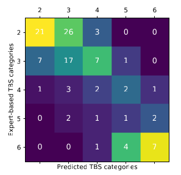
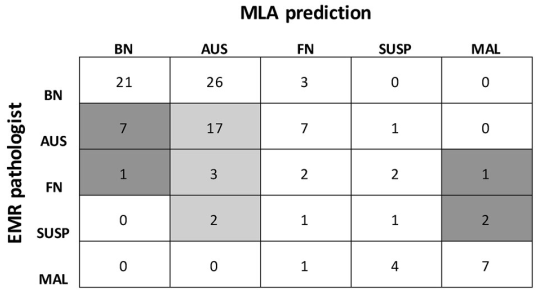
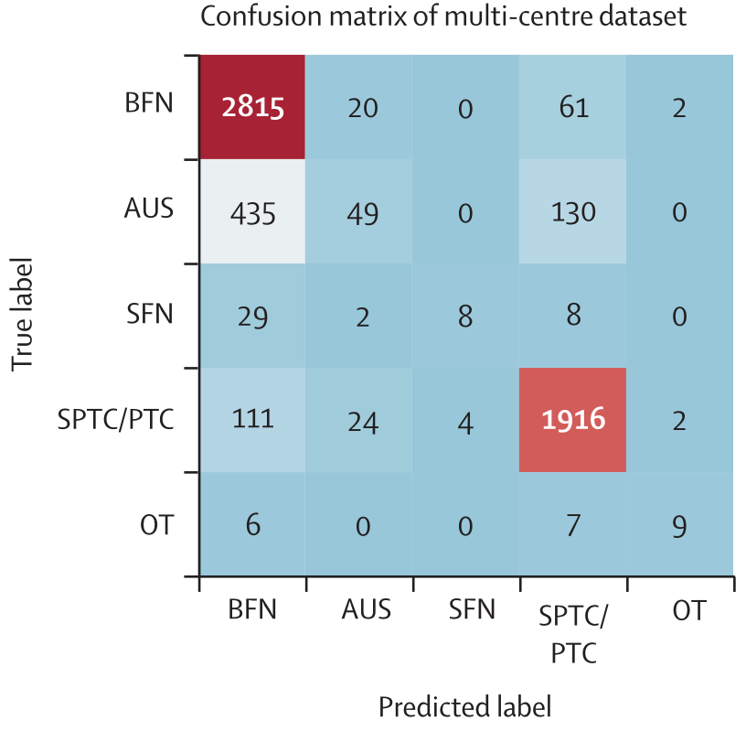

Năm 2018, \cite{or1_image} sử dụng CNN để xác định PTC:B6 and non-PTC:B2 với 370 vi ảnh slide. Sau khi huấn luyện 1 simple CNN với các vi ảnh này, mô hình đã đạt được accuracy 85.06\% trên tập dữ liệu test.

Năm 2019, \cite{or2_wsi} báo cáo tại 1 hội nghị sử dụng 908 WSI với train:test là 799:109. Phương pháp được đề xuất sử dụng hai mạng nơ-ron tích chập (CNN): CNN đầu tiên xác định các vùng hình ảnh có chứa các nhóm tế bào nang tuyến giáp, trong khi CNN thứ hai dự đoán khả năng ung thư tuyến giáp dựa trên các vùng được chọn. Đây là nghiên cứu hiếm hoi có cho số dự đoán nhãn đầu ra là 5 nhờ ưu thế về dữ liệu. Tuy nhiên kết quả khi tính cho 5 nhãn không đủ tốt.

Cùng năm này, \cite{or3_image} sử dụng 279 hình ảnh slide, được chia thành 159 trường hợp ung thư biểu mô tuyến giáp thể nhú (PTC: B6) và 120 trường hợp tổn thương lành tính (non-PTC: B2). Các nhà nghiên cứu đã huấn luyện hai mô hình CNN là VGG-16 và Inception-v3. Mô hình VGG-16 đạt được độ chính xác 97,66\% trên các hình ảnh phân mảnh và độ chính xác 95\% trên cấp độ bệnh nhân. Tuy nhiên nghiên cứu đã thực hiện cắt thủ công các fragment từ ảnh cấp độ bệnh nhân. Ngoài ra họ chưa đề xuất 1 mô hình hợp lý để từ kết quả fragment tổng hợp ra kết quả dự đoán cho bệnh nhân. Kết quả chính xác 95\% thu được là kết quả của việc coi 2 bệnh nhân bị chẩn đoán sai trong số 3 miếng fragment ở quá trình test bị sai.

Năm 2020, từ bài hội nghị \cite{or2_wsi} nhóm nghiên cứu này xuất bản \cite{or4_wsi}. Hướng nghiên cứu của họ vẫn vậy và có kết quả phân loại ở hình sau:

Năm 2021, \cite{or5_image} sử dụng 367 hình ảnh slide, bao gồm 222 trường hợp ung thư biểu mô nhú tuyến giáp (PTC: B6) và 145 trường hợp tổn thương lành tính (Non-PTC: B2). Bài báo thực hiện quy trình xử lý trước phức tạp bao gồm 1 thuật toán cắt tự động và 1 đội nhóm các chuyên gia phải lọc thủ công các fragment này để bộ dữ liệu huấn luyện và kiểm tra đã sạch sẽ nhất. Quy trình này chia các ảnh slide FNA cao ban đầu thành nhiều fragment, mỗi fragment chứa các cụm mô hoặc vùng quan tâm (ROI). Các fragment này sau đó được sử dụng để huấn luyện và kiểm tra các mô hình CNN. Các tác giả đã sử dụng sáu mô hình CNN của ResNet, DenseNet và Inception. Kết quả cho thấy DenseNet161 đạt hiệu suất tốt nhất, với độ chính xác trung bình là 0,9556. Ngoài ra, kết hợp bộ phân loại AdaBoost với kết quả fragment từ 6 mô hình CNN (tức đầu vào là vector 6 * 2 = 12 chiều) đạt độ chính xác lên tới 0,9971. Tuy nhiên nhược điểm có thể thấy được là để suy luận ra kết quả cho 1 ảnh fragment thì phải kết hợp kết quả của nhiều mô hình, nhiều tham số, lâu suy luận ra kết quả. Hơn nữa, tập kiểm tra được sử dụng để đánh giá hiệu suất này là tập hợp các ảnh fragment, chứ không phải ảnh FNAC slide đầy đủ. Mặc dù việc sử dụng fragment giúp tăng kích thước tập dữ liệu và cải thiện hiệu suất phân loại, nhưng nó cũng giới hạn khả năng khái quát hóa của mô hình cho các ảnh slide FNA. Để đánh giá hiệu suất của mô hình trên ảnh slide FNA, bài báo đề xuất một phương pháp để suy luận dựa trên kết quả phân loại trung bình của các fragment. Mặc dù vậy, độ chính xác đạt được ở cấp độ bệnh nhân không được đề cập rõ ràng trong bài báo.

Năm 2022, \cite{or6_wsi} sử dụng 360 WSI từ sinh thiết kim nhỏ tuyến giáp, được chia thành 222 trường hợp lành tính (B2) và 138 trường hợp ác tính (B6). Các tác giả đề xuất một hệ thống hai giai đoạn sử dụng CNN. Giai đoạn đầu tiên sử dụng YOLO V4 để phát hiện vùng ác tính và cắt ra các fragment, trong khi giai đoạn thứ hai sử dụng EfficientNet để phân loại các vùng này thành lành tính hoặc ác tính. Kết quả cho thấy hệ thống hai giai đoạn đạt được độ chính xác 81,84\%, cao hơn 3,16\% so với việc chỉ sử dụng mạng phát hiện YOLO V4. Nhược điểm có thể thấy là mô hình 2 giai đoạn sẽ yêu cầu nhiều tài nguyên tính toán hơn. Thêm nữa bài báo chưa tính đến nhiều mức chẩn đoán khác bên cạnh B2 và B6.

<!-- \cite{or7_wsi} sử dụng 908 mẫu sinh thiết kim nhỏ tuyến giáp (FNAB), trong đó 799 mẫu được dùng để huấn luyện thuật toán và 109 mẫu được dùng để kiểm tra. Phương pháp được sử dụng là một phần mềm sàng lọc dựa trên thuật toán học máy với hai thành phần chính: mạng nơ-ron tích chập (CNN) để xác định các vùng quan tâm (ROI) chứa tế bào nang tuyến giáp và giao diện người dùng đồ họa để hiển thị 100 ROI được xác định là chứa thông tin chẩn đoán nhiều nhất. Kết quả cho thấy sự tương đồng gần như hoàn hảo (j = 0.924) giữa chẩn đoán dựa trên hình ảnh toàn bộ slide (WSI) và chẩn đoán dựa trên 100 ROI được chọn bởi thuật toán. Điều này cho thấy tiềm năng của phần mềm sàng lọc trong việc hỗ trợ chẩn đoán ung thư tuyến giáp, giảm khối lượng công việc của các nhà tế bào học.  -->

Năm 2023, nhóm nghiên cứu \cite{or4_wsi} có mục đích tạo ra mô hình nhỏ gọn chạy cho hình ảnh slide đã xuất bản thêm bài báo \cite{or8_image}. Nghiên cứu sử dụng 964 WSI được quét bằng máy quét Leica AT-2 ở độ phóng đại 40x, các ảnh WSI được cắt thành nhiều hình slide để huấn luyện mô hình MobileNetV2. Sau đó mô hình sẽ đem kiểm tra trên tập các ảnh chụp bởi điện thoại gắn kèm kính hiển vi. Nghiên cứu cung cấp nhiều kết quả AUC, Cl, P của các phương pháp. Và họ kết luận kết quả này cho thấy tiềm năng của việc sử dụng điện thoại di động kết hợp với học máy để chẩn đoán ung thư tuyến giáp, đặc biệt là ở các khu vực có nguồn lực hạn chế. Tuy nhiên, nhóm nghiên cứu không cung cấp các độ đo accuracy hay f1-score để đánh giá hiệu quả của mô hình chung cho các nhãn hoặc phân tích từng nhãn nói riêng.

Sau khi có thêm dữ liệu, nhóm nghiên cứu \cite{or4_wsi} xuất bản thêm \cite{or9_wsi} sử dụng 1928 WSI from FNAB. Nhóm này sử dụng hướng nghiên cứu trước đó là 2 giai đoạn với 2 mô hình VGG11 cho tác vụ xác định ROI quan tâm (slide image) rồi phân loại các ROI. Mục tiêu nhóm này đặt ra là phân loại: lành tính, không xác định và ác tính. Thuật toán đạt khả năng sàng lọc 45,1\% trường hợp là lành tính hoặc ác tính với tỷ lệ nguy cơ ác tính (ROM) lần lượt là 2,7\% và 94,7\%. Thuật toán cũng có thể được sử dụng như một xét nghiệm bổ trợ để giảm số lượng trường hợp không xác định, giảm 21,3\% số trường hợp không xác định với ROM là 1,8\% cho loại lành tính. Nhược điểm của quy trình suy luận kết quả rườm rà vẫn chưa được khắc phục.

Nhóm nghiên cứu mới là \cite{or10_wsi} sử dụng 577 WSI từ các mẫu mô đông lạnh phẫu thuật tuyến giáp. Nghiên cứu này thực hiện trên các mẫu mô đã phẫu thuật, không nằm trong phạm vi chẩn đoán tiền phẫu thuật. Nghiên cứu nhằm chẩn đoán nhanh chóng và chính xác các nốt tuyến giáp trong mổ (IOPD), từ đó giúp bác sĩ phẫu thuật đưa ra quyết định phẫu thuật tiếp hay dừng lại. Các nhà nghiên cứu đã sử dụng các kỹ thuật thị giác máy tính kết hợp với CNN và SVM để tự động nhận dạng tất cả các loại bệnh tuyến giáp. Hệ thống này bao gồm ba giai đoạn chính: thuật toán phân loại bệnh hoàn chỉnh ở cấp độ slide, phân loại lành tính và ác tính ở cấp độ bản vá, và phân loại phân nhóm ở cấp độ bản vá. Kết quả cho thấy phương pháp được đề xuất có thể chẩn đoán chính xác các nốt tuyến giáp trong quá trình phẫu thuật, với độ nhạy 72,65\%, độ đặc hiệu 100,0\% và AUC là 86,32\% trên 191 slide test. Đối với chẩn đoán phân nhóm, AUC tốt nhất là 99,46\% đối với ung thư tuyến giáp thể tủy, với thời gian trung bình là 237,6 giây cho mỗi slide. Tuy nhiên nghiên cứu này cần tìm cách cải thiện thêm quy trình để thời gian suy luận kết quả nhanh hơn, cho phù hợp với môi trường phẫu thuật để giảm thời gian chờ. Bởi riêng việc đông lạnh mẫu mô, cắt lớp và chụp đã tốn khá nhiều thời gian.
Mặt khác, nghiên cứu đã loại trừ các nốt có khả năng ác tính không chắc chắn, sử dụng 1 máy quét đồng nhất, nghiên cứu hồi cứu, và chi phí liên quan đến thiết bị quét, lưu trữ dữ liệu có thể là một rào cản đối với việc triển khai hệ thống AI ở các quốc gia đang phát triển.

\cite{or11_image} có 1535 slide image (1128 lành tính và 407 ác tính) từ 124 bệnh nhân. Các nhà nghiên cứu đã sử dụng kỹ thuật chụp cắt lớp quang học nhiễu xạ tương quan để thu được hình ảnh nhuộm Papanicolaou và phân bố chỉ số khúc xạ (RI) ba chiều của các mẫu sinh thiết kim nhỏ tuyến giáp (FNAB). Thuật toán học máy (MLA) được thiết kế để phân loại các cụm tế bào lành tính và ác tính bằng cách sử dụng hình ảnh màu, hình ảnh RI hoặc cả hai. Kết quả cho thấy MLA sử dụng kết hợp thông tin từ cả hình ảnh màu và hình ảnh RI đạt độ chính xác 100\% trong việc phân loại các cụm tế bào. Nghiên cứu kết luận rằng việc kết hợp dữ liệu hình ảnh RI và dữ liệu hình ảnh màu nhuộm Papanicolaou có thể cải thiện độ chính xác của MLA trong chẩn đoán ung thư tuyến giáp từ các mẫu FNAB. Hạn chế về dữ liệu là chưa bao gồm các mẫu không xác định. Hạn chế về phương pháp là phân loại dựa trên kích thước nhân. Điều này có thể dẫn đến hạn chế trong việc phân loại chính xác các tế bào tuyến giáp lành tính có nhân lớn hoặc các tế bào tuyến giáp ác tính có nhân nhỏ.

Năm 2024, \cite{or13_wsi} sử dụng 17.966 WSI từ 7.420 bệnh nhân, được chia thành tập huấn luyện, tập xác nhận nội bộ, ba tập xác nhận bên ngoài và một tập xác nhận tiền cứu. Nghiên cứu phát triển một hệ thống hỗ trợ AI có tên là ThyroPower, sử dụng deep learning để chẩn đoán các nốt tuyến giáp theo Hệ thống Báo cáo Bethesda về Tế bào học Tuyến giáp (TBSRTC). ThyroPower trích xuất các đặc trưng ở cấp độ tế bào bằng mô hình PAGIN, sau đó kết hợp hai mô hình phân loại cấp WSI (Random Forest và Top-N Feature) để đưa ra quyết định chẩn đoán cuối cùng. Kết quả cho thấy ThyroPower đạt hiệu suất cao trong việc phân biệt lành tính với TBSRTC III+ (AUROC 0,930 cho xác nhận nội bộ và 0,944-0,971 cho xác nhận bên ngoài) và TBSRTC V+ (AUROC 0,990 cho xác nhận nội bộ và 0,965-0,991 cho xác nhận bên ngoài). Nghiên cứu này có ưu điểm là sử dụng một tập dữ liệu lớn và đa trung tâm, giúp tăng cường độ tin cậy và khả năng khái quát hóa của mô hình AI. Hệ thống AI được phát triển, ThyroPower, cho thấy hiệu suất cao trong việc phân loại các nốt tuyến giáp lành tính và ác tính, thậm chí có thể hỗ trợ các nhà giải phẫu bệnh ít kinh nghiệm đưa ra chẩn đoán chính xác hơn. Tuy nhiên, nghiên cứu này cũng có những hạn chế mô hình AI vẫn gặp khó khăn trong việc phân loại chính xác nhiều loại u tuyến giáp, đặc biệt là SFN.

\cite{or14_image} sử dụng các mẫu tế bào tuyến giáp người được nhuộm bằng xanh methylen (MB) và chụp ảnh phân cực huỳnh quang (Fpol). Các nhà nghiên cứu đã phát triển CNN U-Net 2D để phân đoạn tế bào tự động từ hình ảnh Fpol, nhằm giảm thời gian phân tích dữ liệu và đưa công nghệ Fpol MB vào ứng dụng lâm sàng. Kết quả cho thấy mô hình U-Net phân đoạn được 15,8\% số tế bào. Nghiên cứu kết luận rằng việc triển khai phân tích tế bào tự động giúp chẩn đoán dựa trên phân cực huỳnh quang định lượng trở nên khả thi về mặt lâm sàng. Hướng nghiên cứu tiếp theo nghiên cứu này nên hướng tới đó là cung cấp nhãn dự đoán bên cạnh việc chỉ cung cấp nhãn phân đoạn tế bào.

